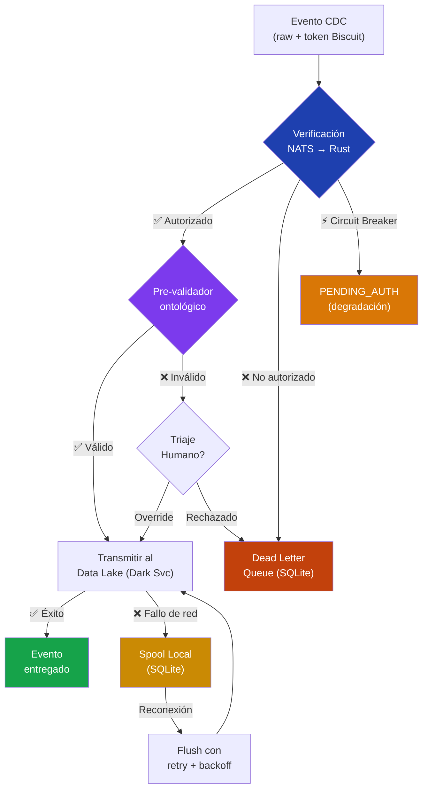
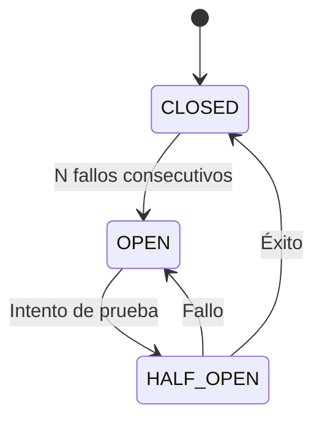
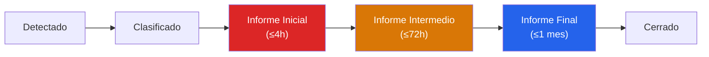

# Edge Connector

> Componente desplegado en la infraestructura del cliente (*on-premise*) que captura cambios transaccionales y los transmite al Data Lakehouse central de forma segura y resiliente.

## Overview

El Edge Connector es el primer eslabón de la cadena de ingesta. Su responsabilidad es cuádruple:

1. **Verificación criptográfica** — Valida tokens Biscuit vía NATS contra el servicio de seguridad Rust
2. **Pre-validación ontológica** — Garantiza que solo datos conformes y estructurados salgan de la red
3. **Resiliencia DORA** — Almacena localmente y reintenta si la red falla, con alertas a dos niveles
4. **Triaje humano** — Permite Human-in-the-Loop para eventos que fallan validación pero requieren revisión



## Estructura del Proyecto

```
src/
├── __init__.py              # Paquete principal
├── __main__.py              # Entry point (python -m src)
├── config_loader.py         # Carga centralizada de settings.yaml
├── validator.py             # Pre-validador ontológico (FINOS CDM + EIAC V06)
├── buffer.py                # Spooling local + DLQ + flush DORA
├── ingestor.py              # Orquestador CDC + verificación NATS
├── triage.py                # Triaje four-eyes + Human-in-the-Loop
├── incident_classifier.py   # Clasificador DORA (RD 2024/1772 Art. 8)
├── dora_notifier.py         # Cadena de notificación DORA (ITS 2025/302)
├── examen_especial.py       # Workflow legal SEPBLAC (Ley 10/2010)
└── screening.py             # Screening de sanciones (EU/OFAC/ONU)

config/
└── settings.yaml            # Configuración del nodo Edge

tests/
├── test_validator.py        # 15 tests de validación
├── test_buffer.py           # 18 tests de buffer/DLQ/DORA
└── test_ingestor.py         # 13 tests de orquestación + auth
```

## Configuración

Toda la configuración se centraliza en `config/settings.yaml` y se carga mediante el módulo `config_loader.py` con dataclasses inmutables y tipadas:

```yaml
edge_connector:
  node_id: "edge-node-001"
  source_system: "CoreBank_V8"

validation:
  schema_path: "/opt/blueupalm/schemas"
  enforce_strict_mode: true

resilience:
  buffer_db_path: "local_spool.db"
  max_retries: 5
  retry_backoff_ms: 1000
  warning_threshold_sec: 300        # Alerta operativa interna (5 min)
  critical_dora_threshold_sec: 7200 # Incidente grave DORA (2h, margen SLA 4h)

network:
  central_endpoint: "blueupalm-datalake.svc"  # Dark Service de OpenZiti
  timeout_sec: 5

nats:
  url: "nats://localhost:4222"
  nkey_seed_path: "/run/secrets/nats_ingestor_nkey"
  verify_timeout_sec: 3
  circuit_breaker_threshold: 5
```

::: tip Despliegue multi-nodo
Cada nodo Edge tiene su propio `settings.yaml`. El `node_id` y `source_system` identifican el origen en los metadatos del evento.
:::

## Componentes

### Verificación Criptográfica vía NATS (`ingestor.py`)

::: warning Cambio v0.2.0
La verificación de tokens Biscuit se realiza vía **NATS Request-Reply** contra el servicio de seguridad Rust, sustituyendo la comunicación HTTP anterior (`localhost:8080`).
:::

El flujo de verificación envía un request al subject `verify.request` con el token y el dominio objetivo:

```json
{
  "token": "<Biscuit Base64>",
  "target_domain": "banking",
  "edge_node_id": "edge-node-001"
}
```

El servicio Rust responde con:

```json
{ "valid": true }
```

o

```json
{ "valid": false, "message": "Domain not authorized" }
```

#### Circuit Breaker (`NatsCircuitBreaker`)

Patrón de resiliencia que evita el rechazo masivo de eventos cuando NATS no está disponible:



| Estado | Comportamiento |
|---|---|
| `CLOSED` | Verificación normal vía NATS |
| `OPEN` | Eventos pasan sin verificar (marcados `PENDING_AUTH`) |
| `HALF_OPEN` | Un evento de prueba para comprobar recuperación |

El umbral de apertura es configurable: `nats.circuit_breaker_threshold` (default: 5 fallos).

### Pre-validador Ontológico (`validator.py`)

Verifica la estructura completa del evento en dos fases:

**Fase 1 — Campos raíz obligatorios:**

| Campo | Tipo | Description |
|---|---|---|
| `eventId` | `string` | Identificador único del evento |
| `timestamp` | `string` (ISO 8601) | Marca temporal del evento |
| `domain` | `string` | Dominio: `banking` o `insurance` |
| `eventType` | `string` | Tipo de operación (ej. `EconomicEvent`, `ClaimSettlement`) |
| `payload` | `object` | Datos del evento según esquema del dominio |

**Fase 2 — Validación por dominio:**

::: code-group
```python [Banking (FINOS CDM)]
# Campos verificados:
payload.transfer.identifier       # Identificador de transacción
payload.transfer.quantity.amount   # Monto numérico
payload.parties                    # Lista no vacía de participantes
```

```python [Insurance (EIAC V06)]
# Campos verificados:
payload.policy.policyNumber       # Número de póliza
payload.claim.claimId             # Identificador de siniestro
payload.settlement.amount         # Monto de liquidación numérico
```
:::

El resultado se encapsula en un `ValidationResult` tipado:

```python
@dataclass
class ValidationResult:
    is_valid: bool
    domain: Optional[str] = None
    errors: list[str] = field(default_factory=list)
```

### Triaje Humano con Four-Eyes (`triage.py`)

Módulo Human-in-the-Loop con segregación de funciones que permite la intervención manual en eventos que fallan la validación:

- **Prioridad HIGH:** Requiere principio de Cuatro Ojos (`supervisor_id ≠ analyst_id`)
- **Prioridad NORMAL/MEDIUM:** Aprobación simple por el analista
- Canal asíncrono con TTL configurable (default 1h) hacia DLQ
- Registro `TriageDecision` para audit trail con `four_eyes_required` y `four_eyes_satisfied`

→ [View documentation completa del triaje y AML](/en/bc/development/aml-compliance)

### Buffer de Resiliencia DORA (`buffer.py`)

Implementa almacenamiento local persistente con SQLite, garantizando cero pérdida de datos ante caídas de red:

| Funcionalidad | Método | Description |
|---|---|---|
| **Enqueue** | `enqueue(event)` | Almacena evento en spool local |
| **Dequeue** | `dequeue(limit)` | Recupera pendientes en orden FIFO estricto |
| **DLQ** | `enqueue_dlq(event, reason)` | Almacena evento rechazado con razón |
| **Flush** | `flush_pending(transmit_fn)` | Retry con backoff exponencial + backpressure |
| **Métricas** | `get_metrics()` | Pendientes, procesados, DLQ, antigüedad |
| **Alertas DORA** | `check_dora_thresholds()` | Sistema de alertas a dos niveles |

#### Alertas DORA a Dos Niveles

::: warning Cambio v0.2.0
El umbral único se reemplazó por un sistema de alertas a dos niveles, alineado con los plazos reales de DORA.
:::

| Nivel | Umbral | Acción |
|---|---|---|
| ⚠️ **WARNING** | `warning_threshold_sec` (300s = 5 min) | Alerta operativa interna |
| 🚨 **CRITICAL** | `critical_dora_threshold_sec` (7200s = 2h) | Clasificación como incidente grave. Escalamiento CSIRT. Notificación al supervisor en ≤4h (DORA Art. 17) |

### Clasificador de Incidentes (`incident_classifier.py`)

Evalúa los criterios del **Reglamento Delegado (UE) 2024/1772 Art. 8** para clasificar incidentes TIC:

| Criterio | Umbral MAJOR | Umbral SIGNIFICANT |
|---|---|---|
| Clientes afectados | ≥ 5.000 | ≥ 500 |
| Volumen transaccional (EUR) | ≥ 10M | ≥ 1M |
| Duración (min) | ≥ 120 | ≥ 30 |
| Extensión geográfica | ≥ 3 jurisdicciones | ≥ 2 |
| Pérdida de datos | Cualificador automático MAJOR ||
| Servicio crítico afectado | Cualificador automático MAJOR ||

Severidad resultante: `MINOR` (score < 2), `SIGNIFICANT` (score 2-4), `MAJOR` (score ≥ 5).

### Notificador DORA (`dora_notifier.py`)

Gestiona la cadena de notificación según **ITS 2025/302**:



- Persiste incidentes en tabla `dora_incidents` de SQLite
- Genera borradores del **Informe Inicial** (Anexo I ITS 2025/302)
- Detecta notificaciones con plazos vencidos
- Publica alertas en subjects NATS (`dora.alert.>`)

### Orquestador CDC (`ingestor.py`)

El `CDCIngestor` coordina todo el flujo v0.2.0:

1. **Verifica** token Biscuit vía NATS (con circuit breaker)
2. **Valida** mediante `PreValidator`
3. **Triaje** Human-in-the-Loop si la validación falla
4. **Enriquece** metadatos (`sourceSystem`, `edgeNodeId`, `ingestionLatencyMs`, `verificationMethod`, `circuitBreakerState`)
5. **Transmite** al Data Lake (Dark Service) o fallback al spool
6. **Verifica** umbrales DORA tras cada operación

#### Heartbeat y Telemetría

El método `heartbeat()` emite el estado del nodo para monitorización:

```json
{
  "node_id": "edge-node-001",
  "source_system": "CoreBank_V8",
  "spool_pending": 3,
  "spool_processed": 142,
  "dlq_count": 2,
  "oldest_pending_sec": 45.7,
  "warning_threshold_sec": 300,
  "critical_dora_threshold_sec": 7200,
  "circuit_breaker_state": "CLOSED",
  "verification_method": "nats",
  "status": "DEGRADED"
}
```

| Estado | Condición |
|---|---|
| `HEALTHY` | Sin eventos pendientes en el spool |
| `DEGRADED` | Hay eventos pendientes (red inestable) |

## Ejecución

### Demo

```bash
python -m src
```

### Tests

```bash
python -m pytest tests/ -v
```

| Suite | Tests | Cobertura |
|---|---|---|
| `test_validator.py` | 15 | FINOS CDM, EIAC V06, campos raíz, modo estricto/permisivo |
| `test_buffer.py` | 18 | FIFO, DLQ, flush/retry/backpressure, métricas, alertas DORA |
| `test_ingestor.py` | 13 | Flujo completo, fallback, DLQ, auth NATS, four-eyes, heartbeat |
| **Total** | **65** | *Incluye suites adicionales de AML y DORA* |
