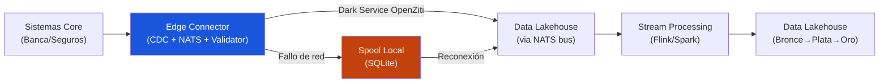

# Architecture de Ingesta

> Captura, validación y transporte de datos transaccionales desde el Edge al Data Lakehouse.

La capa de ingesta de BlueUPALM se fundamenta en una arquitectura orientada a eventos, diseñada para soportar procesamiento en tiempo casi real (*near real-time*) y garantizar la inmutabilidad y auditabilidad exigida por la normativa PBC/FT.

## Flujo Lógico



1. **Sistemas Core (Banca/Seguros):** Origen transaccional de los datos (bases de datos relacionales, AS400, etc.).
2. **Edge Connector (CDC + NATS + Validator):** Captura cambios a nivel de fila, verifica tokens Biscuit vía NATS y valida la estructura ontológica.
3. **Bus NATS:** Bus de mensajería ligero que conecta el Edge Connector con el servicio de seguridad Rust y transporta los datos validados a través de Dark Services de OpenZiti.
4. **Stream Processing:** Transformación final, deduplicación y enrutamiento (Apache Flink o Spark Streaming).
5. **Data Lakehouse:** Almacenamiento estructurado en capas (Bronce, Plata, Oro) con formatos abiertos (Parquet/Delta Lake).

## Estrategia CDC (Change Data Capture)

La captura de datos se realiza directamente desde los logs de transacciones de las bases de datos origen (Oracle Redo Logs, PostgreSQL WAL, SQL Server WAL), garantizando baja latencia y mínimo impacto en rendimiento.

- **Captura de Eventos:** Operaciones granulares de `INSERT`, `UPDATE` y `DELETE`.
- **Payload Raw:** Estado anterior (`before`), estado actual (`after`) y metadatos de la transacción (timestamp, identificador, tabla origen).

### Resiliencia en el Edge (Cumplimiento DORA)

::: warning Requisito regulatorio
Para cumplir con los SLAs del **Reglamento DORA** frente a incidentes TIC, el Edge Connector implementa mecanismos de resiliencia autónoma.
:::

| Mecanismo | Description |
|---|---|
| **Spooling Local** | Ante pérdida de conectividad, los eventos se almacenan en un búfer SQLite persistente sin detener la lectura del log transaccional |
| **Reconexión + Backpressure** | Sincronización cronológica estricta con control de flujo para no saturar el enlace recuperado |
| **Alertas a dos niveles** | ⚠️ WARNING (5 min) para alerta operativa interna; 🚨 CRITICAL (2h) para clasificación como incidente grave y escalamiento CSIRT (SLA 4h, DORA Art. 17) |
| **Circuit Breaker NATS** | Degradación controlada si el servicio de verificación no responde: eventos se procesan como `PENDING_AUTH` |
| **Dead Letter Queue** | Eventos rechazados por validación o autorización se almacenan en DLQ para revisión |
| **Triaje Humano** | Human-in-the-Loop para eventos que fallan validación pero requieren supervisión especial |

## Armonización Ontológica y Validación

La disparidad estructural entre sistemas bancarios y aseguradores se resuelve mediante convergencia hacia modelos estándar del sector.

### Pre-validator en el Edge

Antes de que cualquier dato abandone la red de la entidad, el Edge Connector ejecuta un **Pre-validator** que:

1. **Intercepta** el evento CDC *raw*
2. **Valida** la estructura raíz obligatoria (`eventId`, `timestamp`, `domain`, `eventType`, `payload`)
3. **Verifica** los campos específicos del dominio contra esquemas FINOS CDM o EIAC V06
4. **Rechaza** eventos malformados a la DLQ local para revisión

::: tip Soberanía del dato
Solo salen de la red de la entidad datos estructurados y validados, mitigando riesgos de fuga de información accidental.
:::

### Dominio Bancario (FINOS CDM)

Entidades del Core bancario transformadas al *Common Domain Model*:

| Core Bancario | FINOS CDM |
|---|---|
| Tabla de clientes | `Party` |
| Contratos | `Account` |
| Transferencias | `EconomicEvent` / `Transfer` |

**Campos validados:** `transfer.identifier`, `transfer.quantity.amount` (numérico), `parties` (lista no vacía).

### Dominio Asegurador (EIAC V06)

El modelo estándar de seguros adaptado para transmisión en streaming:

| Core Asegurador | EIAC V06 |
|---|---|
| Pólizas | `Policy` |
| Participantes | `PartyRole` |
| Siniestros | `Claim` |
| Liquidaciones | `Settlement` |

**Campos validados:** `policy.policyNumber`, `claim.claimId`, `settlement.amount` (numérico).

## Architecture del Data Lakehouse

Los eventos validados se almacenan en un Data Lakehouse con tres capas (Medallion Architecture):

### Zona Raw (Bronce)
Almacenamiento inmutable de los eventos tal cual llegan del bus de streaming. Conserva todo el histórico con máxima granularidad temporal. Sirve como **origen único de la verdad** y pista de auditoría regulatoria.

### Zona Armonizada (Plata)
Datos limpios, filtrados, deduplicados y completamente estructurados bajo los esquemas FINOS/EIAC. Aquí se resuelve la **identidad cruzada del cliente** (resolución de entidades y KYC global).

### Zona Curada (Oro)
Modelos dimensionales y vistas materializadas para consumo directo. Capa de **ultra-baja latencia** para el Motor de Alertas y Dashboards directivos.

## Esquemas de Datos

### Evento Bancario (FINOS CDM)

```json
{
  "eventId": "evt-bnk-987654321",
  "timestamp": "2026-04-18T10:15:30.123Z",
  "domain": "banking",
  "eventType": "EconomicEvent",
  "payload": {
    "transfer": {
      "identifier": "tx-1029384756",
      "quantity": {
        "amount": 15000.00,
        "currency": "EUR"
      },
      "payerReceiver": {
        "payerAccountReference": "acc-es-0049-1234-56-1234567890",
        "receiverAccountReference": "acc-ky-8888-9999-00-1111111111"
      },
      "settlementDate": "2026-04-18"
    },
    "parties": [
      { "partyId": "pty-b-112233", "role": "Payer" },
      { "partyId": "pty-ext-998877", "role": "Receiver" }
    ]
  },
  "metadata": {
    "sourceSystem": "CoreBank_V8",
    "edgeNodeId": "edge-node-001",
    "preValidatorPassed": true,
    "ingestionLatencyMs": 45,
    "verificationMethod": "nats",
    "circuitBreakerState": "CLOSED"
  }
}
```

### Evento Asegurador (EIAC V06)

```json
{
  "eventId": "evt-ins-123456789",
  "timestamp": "2026-04-18T10:45:00.000Z",
  "domain": "insurance",
  "eventType": "ClaimSettlement",
  "payload": {
    "policy": {
      "policyNumber": "POL-2025-XX-999",
      "productType": "Unit Linked"
    },
    "claim": {
      "claimId": "CLM-2026-00123",
      "status": "Closed"
    },
    "settlement": {
      "amount": 250000.00,
      "currency": "EUR",
      "beneficiaryPartyId": "pty-i-445566",
      "paymentMethod": "WireTransfer",
      "targetAccount": "acc-ch-1234-5678-90"
    }
  },
  "metadata": {
    "sourceSystem": "LifeInsure_Sys",
    "edgeNodeId": "edge-node-001",
    "preValidatorPassed": true,
    "ingestionLatencyMs": 60,
    "verificationMethod": "nats",
    "circuitBreakerState": "CLOSED"
  }
}
```
