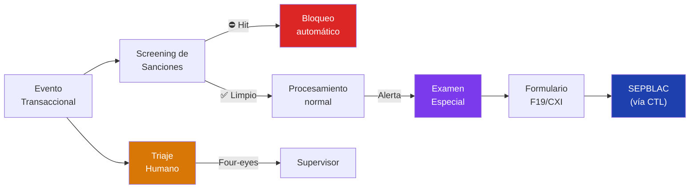
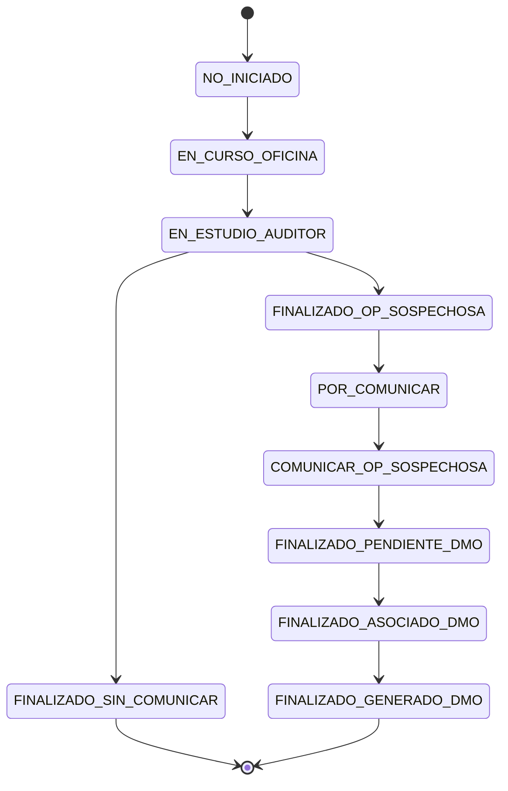
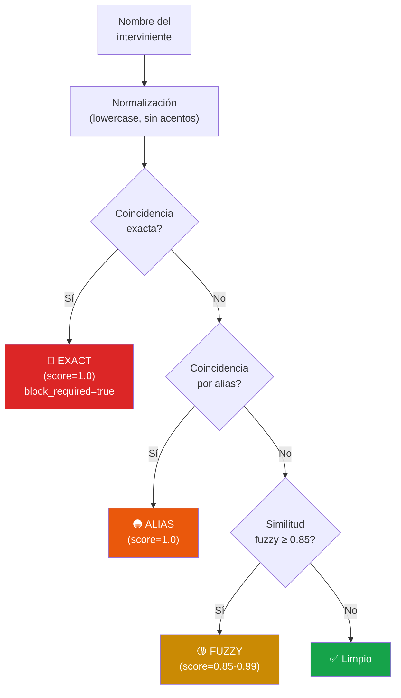
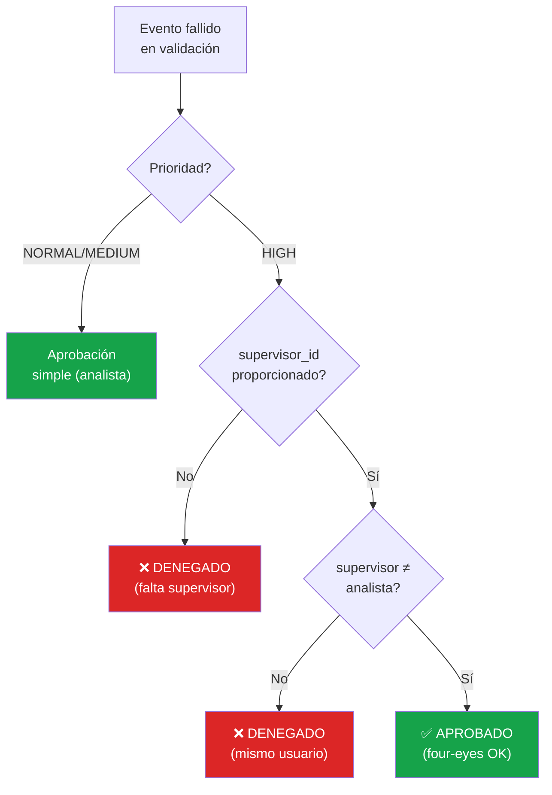

# Lógica Normativa AML

> Módulos de cumplimiento de la Ley 10/2010 de Prevención de Blanqueo de Capitales y Financiación del Terrorismo.

## Visión General

La capa normativa del Edge Connector implementa tres capacidades obligatorias para entidades financieras supervisadas:



## Examen Especial (`examen_especial.py`)

Gestiona el ciclo de vida completo del expediente de sospecha de blanqueo según la **Ley 10/2010 Art. 18** y el workflow de 10 estados definido en la documentación de misión.

### Máquina de Estados



| # | Estado | Descripción |
|---|---|---|
| 1 | `NO_INICIADO` | Expediente creado, pendiente de asignación |
| 2 | `EN_CURSO_OFICINA` | Análisis inicial en la oficina de origen |
| 3 | `EN_ESTUDIO_AUDITOR` | Revisión por el auditor interno |
| 4 | `FINALIZADO_SIN_COMUNICAR` | Conclusión: sin indicios *(terminal)* |
| 5 | `FINALIZADO_OP_SOSPECHOSA` | Conclusión: operación sospechosa confirmada |
| 6 | `POR_COMUNICAR` | Pendiente de comunicación al SEPBLAC |
| 7 | `COMUNICAR_OP_SOSPECHOSA` | Comunicación en curso |
| 8 | `FINALIZADO_PENDIENTE_DMO` | Comunicado, pendiente documento DMO |
| 9 | `FINALIZADO_ASOCIADO_DMO` | DMO asociado al expediente |
| 10 | `FINALIZADO_GENERADO_DMO` | DMO generado *(terminal)* |

### Audit Trail Inmutable

Cada transición de estado se registra en la tabla `examen_audit_trail`:

| Campo | Tipo | Descripción |
|---|---|---|
| `case_id` | `TEXT` | Referencia al expediente |
| `from_state` | `TEXT` | Estado origen |
| `to_state` | `TEXT` | Estado destino |
| `analyst_id` | `TEXT` | Analista que ejecuta la transición |
| `justification` | `TEXT` | Justificación obligatoria |
| `attachments` | `JSON` | Documentos adjuntos |

::: warning Transiciones ilegales
Cualquier intento de transición no definida en el grafo lanza un `ValueError`. No es posible retroceder en el workflow.
:::

### Generación de F19/CXI

El formulario de comunicación al SEPBLAC se genera automáticamente cuando el expediente alcanza el estado `POR_COMUNICAR` o posterior:

```python
report: F19Report = examen.generate_f19(
    case_id="EE-20260418-ALT-123",
    analyst_id="analyst-001",
    supervisor_id="supervisor-002",
)
```

Campos del formulario:

| Sección | Campos |
|---|---|
| **Identificación** | `case_id`, `entity_name`, `alert_ids` |
| **Sujeto** | `subject_name`, `subject_id_type`, `subject_id_number` |
| **Tipología** | `typology_code`, `typology_description` |
| **Hechos** | `facts_description`, `period_start`, `period_end` |
| **Datos económicos** | `total_amount_eur`, `num_operations` |

## Screening de Sanciones (`screening.py`)

Motor local de verificación obligatoria de intervinientes contra listas de sanciones internacionales.

### Listas Soportadas

| Fuente | Código | Descripción |
|---|---|---|
| EU Consolidated | `EU_CONSOLIDATED` | Lista consolidada de sanciones de la UE |
| OFAC SDN | `OFAC_SDN` | Specially Designated Nationals (EE.UU.) |
| ONU Consolidated | `UN_CONSOLIDATED` | Lista consolidada del Consejo de Seguridad |
| PEPs Interno | `PEP_INTERNAL` | Personas Expuestas Políticamente |
| Watchlist Interna | `INTERNAL_WATCHLIST` | Lista interna de la entidad |

### Algoritmo de Matching

El screening se ejecuta en tres niveles secuenciales:



| Nivel | Tipo | Score | Bloqueo |
|---|---|---|---|
| 1 | **Exacto** | 1.0 | ⛔ Automático |
| 2 | **Alias** | 1.0 | ⚠️ Revisión |
| 3 | **Fuzzy** (Dice bigrams) | ≥ 0.85 | ⚠️ Revisión |

::: tip Coeficiente de Dice
El matching fuzzy usa bigrams de caracteres con el coeficiente de Dice: `2 × |A ∩ B| / (|A| + |B|)`. Es robusto ante transposiciones y errores tipográficos menores.
:::

### Resultado del Screening

```python
@dataclass
class ScreeningResult:
    screened_count: int          # Intervinientes verificados
    hit_count: int               # Coincidencias encontradas
    hits: list[ScreeningHit]     # Detalle de cada hit
    block_required: bool         # True si hay coincidencia exacta
```

## Triaje Humano con Four-Eyes (`triage.py`)

### Principio de Cuatro Ojos

::: warning Segregación de funciones
Para overrides de riesgo `HIGH`, se exige la participación de dos personas distintas:
- **analyst_id** — El analista que revisa el evento
- **supervisor_id** — El supervisor que aprueba (debe ser ≠ analyst_id)
:::



### Registro de Decisiones

Cada decisión de triaje genera un `TriageDecision` para audit trail:

```python
@dataclass
class TriageDecision:
    event_id: str
    approved: bool
    analyst_id: str
    supervisor_id: Optional[str]
    justification: str
    four_eyes_required: bool
    four_eyes_satisfied: bool
    timestamp: float
```

### Canal Asíncrono

Las solicitudes de triaje se encolan con un TTL configurable (`triage_timeout_sec`, default 1 hora). Si se supera el plazo sin respuesta, el evento se envía automáticamente a la DLQ.

En producción, el canal se conectará al subject NATS `triage.request` para integración con la interfaz del operador.
