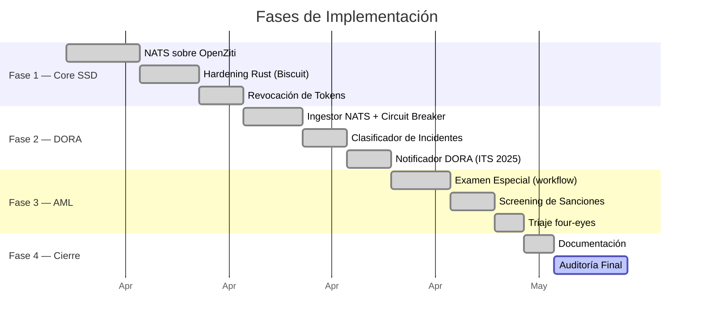

# Roadmap de Implementación

> Transformación del prototipo en una infraestructura de grado bancario con NATS, OpenZiti y cumplimiento normativo DORA/PBC.

::: info Estado actual
Fases 1–3 con código implementado y **65/65 tests unitarios** pasando. Pendiente despliegue e integración end-to-end.
:::

## Visión General

## Fase 1: Infraestructura de Mensajería y Seguridad ✅

*Objetivo: Resolver los hallazgos críticos de comunicación y gestión de claves.*

### 1.1 Despliegue de NATS sobre OpenZiti

- NATS con JetStream, autenticación NKey (Ed25519) y ACLs por subject
- Añadido a `docker-compose.yaml` con healthcheck y volumen persistente
- Endpoint público eliminado → migrado a Dark Service `blueupalm-datalake.svc`

### 1.2 Hardening de `edge-security` (Rust)

- **Persistencia de KeyPair:** Carga desde archivo PKCS#8 (Ed25519 seed), auto-generación en primer arranque, permisos `0400`
- **Binding Criptográfico:** Tokens Biscuit con 3 caveats Datalog: `operation_domain`, `time` (TTL 1h), `edge_node`
- **Comunicación NATS:** Verificador migrado a suscriptor `verify.request` (request-reply). Endpoint HTTP `/verify` eliminado

### 1.3 Sistema de Revocación de Tokens

- Bucket NATS JetStream KV `revoked_tokens` como CRL distribuida
- Consulta KV antes de cada autorización (fail-fast)
- Endpoint `POST /revoke` para administradores con retención de 30 días

## Fase 2: Ingesta Resiliente y Cumplimiento DORA ✅

*Objetivo: Asegurar la continuidad de negocio y la notificación legal.*

### 2.1 Refactorización del CDCIngestor

- Verificación de tokens migrada de HTTP a NATS request-reply (`nats-py`)
- **Circuit Breaker:** tras N fallos consecutivos, degradación controlada (`PENDING_AUTH`)
- Metadatos enriquecidos con `verificationMethod` y `circuitBreakerState`

→ [Ver Edge Connector](/es/bc/development/edge-connector)

### 2.2 Clasificación de Incidentes

Clasificación según **RD (UE) 2024/1772 Art. 8** con 6 criterios y puntuación acumulativa.

→ [Ver Lógica Normativa](/es/bc/development/aml-compliance)

### 2.3 Notificación DORA

Cadena de escalamiento **ITS 2025/302**: Inicial (4h), Intermedio (72h), Final (1 mes).

### 2.4 Umbrales DORA Separados

| Nivel | Umbral | Acción |
|---|---|---|
| ⚠️ WARNING | 300s (5 min) | Alerta operativa interna |
| 🚨 CRITICAL | 7200s (2h) | Incidente grave → CSIRT → Supervisor (≤4h) |

## Fase 3: Lógica Normativa y Workflow AML ✅

*Objetivo: Implementar los requisitos legales de prevención de blanqueo.*

### 3.1 Examen Especial (Ley 10/2010 Art. 18)

Máquina de estados de 10 pasos con audit trail inmutable y generación de formularios F19/CXI.

### 3.2 Screening de Sanciones

Motor local con matching en 3 niveles (exacto, alias, fuzzy) contra listas EU/OFAC/ONU.

### 3.3 Triaje con Segregación de Funciones

Principio de Cuatro Ojos: eventos `priority=HIGH` requieren `supervisor_id ≠ analyst_id`.

→ [Ver Lógica Normativa AML](/es/bc/development/aml-compliance)

## Fase 4: Documentación y Cierre

*Objetivo: Alinear la documentación con la realidad técnica.*

- [x] Actualización del tech-stack con NATS y Key Management
- [x] Actualización del SSD mapping (7→13 controles)
- [ ] **Informe de Auditoría Final** — test de intrusión, integración end-to-end, verificación de puertos HTTP

## Pendientes

::: warning Acciones requeridas para producción

| Item | Prioridad |
|---|---|
| **NATS clustering** (3 nodos mínimo) | MEDIA |
| **NKeys reales** (`nsc generate nkey -u` por servicio) | ALTA |
| **TLS en NATS** (certs del PKI de OpenZiti) | ALTA |
| **DPIA (RGPD Art. 35)** | MEDIA |
| **Renderizado PDF/XML para Informes ITS** | BAJA |
| **Pipeline de actualización OpenSanctions** | MEDIA |
| **Consumer SIEM para `dora.alert.>`** | BAJA |

:::
